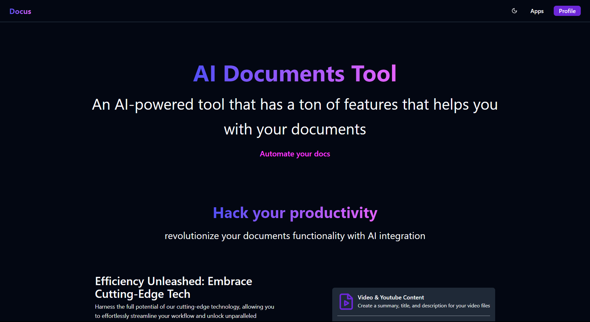

<!-- PROJECT LOGO -->
 

  

  <h3 align="center">docus.autos</h3>

  

    AI into your documents
     
    <a href="https://docus-autos.vercel.app/"><strong>Explore the docus.autos »</strong></a>
     
     
  

<!-- TABLE OF CONTENTS -->

  
Table of Contents

  <ol>
    <li>
      <a href="#about-the-project">About The Project</a>
    </li>
    <li>
        <a href="#built-with">Built with</a>
        <ul>
            <li><a href="#front-end">Front end</a></li>
            <li><a href="#ui">UI</a></li>
            <li><a href="#auth">Auth</a></li>
            <li><a href="#back-end">Back end</a></li>
            <li><a href="#hosting">Hosting</a></li>
      </ul>
    </li>
    <li><a href="#roadmap">Roadmap</a></li>
    <li><a href="#license">License</a></li>
    <li><a href="#contact">Contact</a></li>
    <li><a href="#acknowledgments">Acknowledgments</a></li>
  </ol>

<!-- ABOUT THE PROJECT -->

## About The Project

This app was developed to participate in the [Hanko Hackathon](https://www.hanko.io/hackathon) and it consists of an 🚀 AI App 🤖

Inside the app, you will find several functionalities, including:

- 🎥 **Video files**

  - Ability to generate summaries (also works with videos directly from YouTube! 🎬)
  - Create catchy descriptions and titles for YouTube (useful for content creators 📹)
  - Customized prompts ✨
  - Chat with AI about the video 🗨️

- 📄 **Article files (PDFs)**

  - Ability to generate concise summaries 📝
  - Capability to create blog posts (useful for content creators 📝)
  - Customized prompts ✨
  - Chat with AI about the article 🗨️

- 🔊 **Audio files (PDFs)**

  - Ability to generate audio summaries 🔊
  - Ability to create audio transcriptions 🔊
  - Customized prompts ✨
  - Chat with AI about the audio 🗨️

- 🌐 **Websites (URL)**
  - Ability to create a summary for a website 🌐
  - Ability to generate an FAQ ❓
  - Ability to create a tutorial/guide (useful for content creators 📚)
  - Customized prompts ✨
  - Chat with AI about the website 🗨️

> <strong>And of course, the most important feature, the use of Hanko as an authentication system, easy and practical! 🔒</strong>

(<a href="#readme-top">back to top</a>)

## Built With

#### Front-end

- Node 🟢
- Typescript 📘
- Vite 🌀
- React ⚛️

##### UI

- Tailwind CSS 🎨
- Radix UI 🖌️
- Shadcn UI 🎆

#### AUTH

> <strong> Hanko 🔒</strong>

#### Back-end

- Node 🟢
- Typescript 📘
- Fastify 🚀
- AI (Vercel) 🤖
- OpenAI 🧠
- ORM: Prisma 🛠️
- Database: MongoDB 📊

#### Hosting

- Front end: Vercel 🔼
- Back end: Render 🛼
- Database: Mongo Cloud 🌿

(<a href="#readme-top">back to top</a>)

## Roadmap

- [x] Host the backend on render
- [x] Host the frontend on vercel
- [ ] Add option for language choose on generate transcriptions
- [ ] Add option for new gpt modeles

## License

Distributed under the MIT License. See `LICENSE` for more information.

(<a href="#readme-top">back to top</a>)

<!-- CONTACT -->

## Contact

Ricardo Freitas - [@rmotafreitas](https://x.com/rmotafreitas)

Project Link: [https://github.com/rmotafreitas/docus.autos](https://github.com/rmotafreitas/docus.autos)

(<a href="#readme-top">back to top</a>)

<!-- ACKNOWLEDGMENTS -->

## Acknowledgments

- [Choose an Open Source License](https://choosealicense.com)
- [Hanko](https://www.hanko.io)
- [Readme](https://github.com/othneildrew/Best-README-Template)
